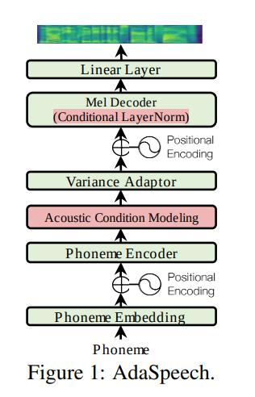
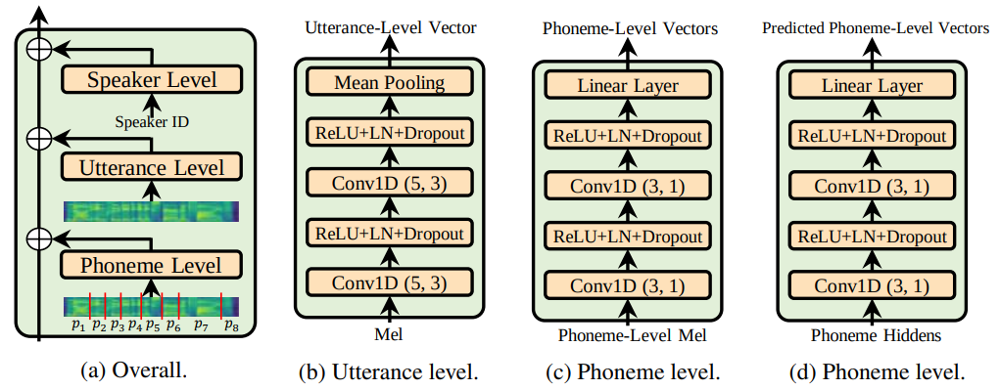
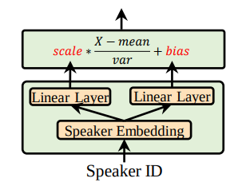

# AdaSpeech - PyTorch Implementation

This is an unofficial PyTorch implementation of AdaSpeech. [**AdaSpeech: Adaptive text to speech for custom voice**](https://arxiv.org/pdf/2103.00993.pdf).

This project is based on [ming024's implementation](https://github.com/ming024/FastSpeech2) of FastSpeech 2.



## Note:
* Support multi languague training, the default phoneme support Vietnamese and English, custom for other language
* `Utterance level encoder` and `Phoneme level encoder` to improve acoustic generalization



* `Conditional layer norm` which is the soul of AdaSpeech paper



## Requirements:

* Install Pytorch
Before installing pytorch please check your Cuda version by running following command : 
`nvcc --version`

```
pip install -r requirements.txt
```

# Training

## Preprocessing

- First, align the corpus by using MFA tool to get TextGrid (note that you have to run each language separately then move all speaker's TextGrid in to single folder named "textgrid")
- copy textgrid folder in to preprocessed path

run the preprocessing script

```
python preprocess.py config/pretrain/preprocess.yaml
```
## Training

Train baseline model with
```
python train.py [-h] [-p PREPROCESS_CONFIG_PATH] [-m MODEL_CONFIG_PATH] [-t TRAIN_CONFIG_PATH] [--vocoder_checkpoint VOCODER_CHECKPOINT_PATH] [--vocoder_config VOCODER_CONFIG_PATH]
```

# Finetune

## Preprocessing

First, align the corpus by using MFA tool to get TextGrid (note that only finetune 1 speaker for best quality)

run the preprocessing script

```
python preprocess.py config/finetune/preprocess.yaml
```

## Finetune

Finetune speaker voice with

```
python train.py [-h] [--pretrain_dir BASE_LINE_MODEL_PATH] [-p PREPROCESS_CONFIG_PATH] [-m MODEL_CONFIG_PATH] [-t TRAIN_CONFIG_PATH] [--vocoder_checkpoint VOCODER_CHECKPOINT_PATH] [--vocoder_config VOCODER_CONFIG_PATH]
```

# TensorBoard

Use

```
tensorboard [--logdir LOG_PATH]
```

# References
- [**AdaSpeech: Adaptive text to speech for custom voice**](https://arxiv.org/pdf/2103.00993.pdf).
- [ming024's implementation](https://github.com/ming024/FastSpeech2)
- [rishikksh20's AdaSpeech implementation](https://github.com/rishikksh20/AdaSpeech)

# Citation
```bibtex
@misc{chen2021adaspeech,
      title={AdaSpeech: Adaptive Text to Speech for Custom Voice}, 
      author={Mingjian Chen and Xu Tan and Bohan Li and Yanqing Liu and Tao Qin and Sheng Zhao and Tie-Yan Liu},
      year={2021},
      eprint={2103.00993},
      archivePrefix={arXiv},
      primaryClass={eess.AS}
}
```


