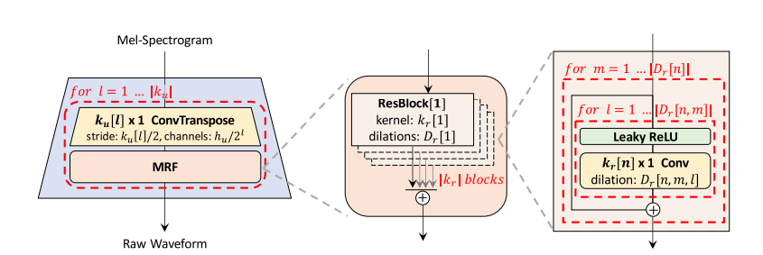
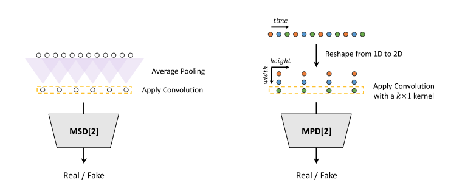

# HiFi-GAN: Generative Adversarial Networks for Efficient and High Fidelity Speech Synthesis

## 1. Model 
Base on paper [Hifigan](https://arxiv.org/pdf/2010.05646.pdf
)

- Generator



- Discriminator



## 2. Training

Processing dataset:

```bash
    $ /path/to/datastet/: Path to dataset
        ├── /path/to/datastet/
        │       └── wavs
        |           └──...

    $ python src/preprocessing/preprocessing.py [--wav_dirs PATH_TO_DATASET]
```

Train:
```bash
    $ python train.py [--config CONFIG_PATH] [--save_path PATH_SAVE_MODEL] 
```

Fine-tune:
```bash
    $ python train.py [--config CONFIG_PATH] [--save_path PATH_SAVE_MODEL] [--pretrained_checkpoint PRETRAINED_PATH] 
```
